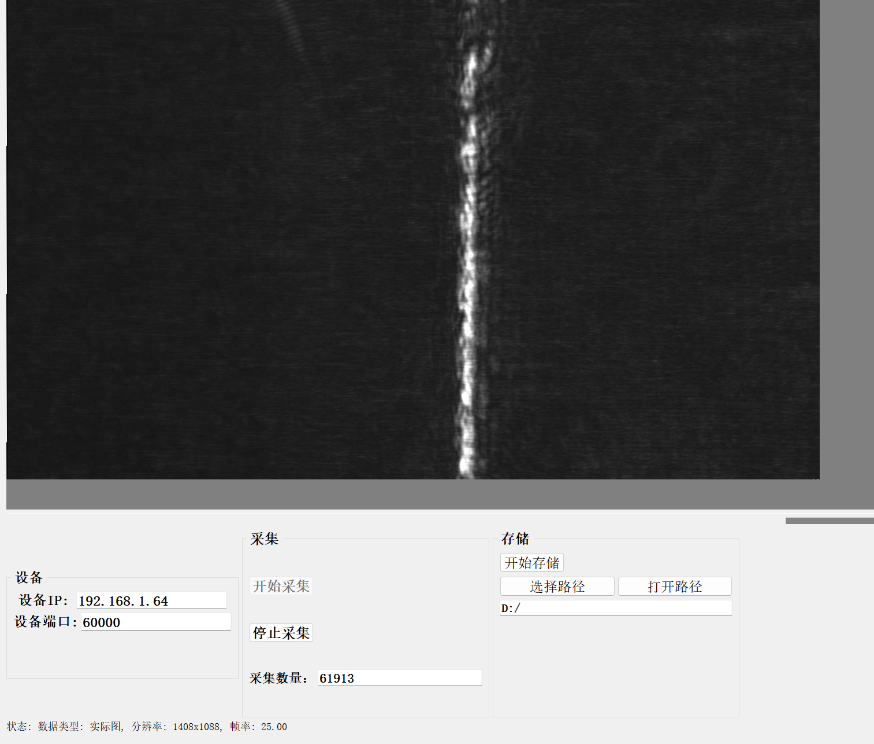
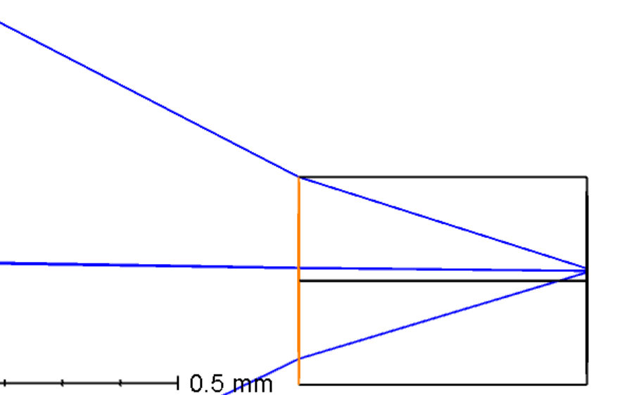

**实时检焦模块**

1.  **概述**
2.  **技术背景介绍**

    利用光学三角测量原理，使聚焦在探测器平面的光斑根据对焦位置的不同分布在探测不同位置，由此可以快速判断出物镜聚焦位置对目标进行实时、快速、准确的对焦。利用入射光倾斜入射至对焦平面，不同的对焦距离斜入射光的光程不一致，则返回光的位置发生变化，由此确定对焦位置

    

    对焦模块输出激光激光入射到物镜达到样品面，样品面的反射光重新进入模块到达传感器，传感器传输数据给FPGA分析模块，计算当前对焦特征值输出。

    

3.  **系统参数**
    1.  外形尺寸 135x85x85mm

        

    2.  对焦精度：极限精度20倍物镜下 0.45NA条件下±50nm，综合条件下测试精度±1/8景深
    3.  对焦模块计算速度 最快模式2KHZ
    4.  激光波长850nm/785nm功率10mw-200mw 可对反射率0.2%以上样品进行对焦
    5.  对焦范围20倍物镜下对焦范围±100um （和样品物镜倍率有关）
    6.  供电接口12v 5A
    7.  支持通讯接口 R232 CAN SPI 模拟量
4.  **应用场景**

    模块适用于显微成像系统，可对反射率＞0.5%样品进行对焦。

5.  刻蚀硅片：可直接对硅片和空气界面直接对焦

    

6.  不同厚度，不同折射率的两层介质芯片可以两种材料直接交接面进行对焦。

    

7.  对内部有溶液的生物芯片可在溶液与材料直接的平面进行对焦。

****

1.  凹凸反射率不均的样品进行对焦

    例如带有微结构的生物芯片或者刻蚀后反射率不均的硅片。

    

2.  多层反射面条件

    多层反射面会对对焦光斑产生干扰，影响系统对焦判断。本系统可对相近的两个平面进行区分判断。

    例如两个反射面相近100um 且有特殊图案微结构，本方案可分辨两个反射面并且选择其中一面进行对焦。

    

3.  光学偏置补偿

    当需要对焦面与物镜成像焦面需要光程差时，可调节对焦模块中光学器件位置，产生光程差来进行补偿。

    

4.  **原理和设计**
5.  **光学原理**

    假设点光源，平行光垂直入入射物镜：

    根据光学系统放大倍率可知：

    $$
    \frac{x}{\Delta} = \frac{f_{2}}{f_{1}}
    $$

    $$
    \tan u = \frac{2 \delta}{x}
    $$

    $$
    \tan u = \frac{f_{1}}{s}
    $$

    由公式2和3可得，

    $$
    \frac{\delta}{x} = \frac{2 f_{1}}{s}
    $$

    公式4 将公式4带入到公式1当中得到 物方离焦量在传感器上平移关系：

    $$
    \frac{\Delta}{\sigma} = \frac{f_{2}}{f_{1}} \cdot \frac{2 s}{f_{1}}
    $$

    因此f2与f1比值越大 ，入射激光偏离主光轴距离越大，对焦系统的灵敏度越高。

    因此给出设计参数如下：

    F1=10mm 20倍物镜条件下，最大偏离S=2mm 由物镜的入瞳口径决定。F2设计值=200mm ，因此系统灵敏度=8。

    以此参数进行仿真，物镜的口径4mm 入射圆形光斑充满一半物镜2mm。

    通过zemax仿真 光斑偏离程度与离焦量的关系如下：

    

6.  **光学设计**

    适配不同口径的物镜。入射激光的入瞳大于常用物镜。大部分物镜的入瞳＜20mm。偏轴入射物镜因此入射光斑口径＞10mm。

    光斑形态为线激光，因此入射光一个方向为平行光另一个为发散光。

    聚焦光斑长度要求，聚焦光斑经过系统放大大于等于传感器的宽度

    传感器宽度1024x3.45微米=3.532mm

    聚焦光斑宽度要求在传感器上＞20个像素

    由此可得到 激光入射部分 x和y方向等效焦距为 xxxx

    返回接受光，采用200mm焦距透镜，位于焦平面上。

7.  **特征算法描述：**

    将CMOS采集二维信号在一个维度上求和，将二维信号转换为一维信号。进行8倍插值采样。

    

    但是一维信号由于样品不同，所产生杂散光对信号产干扰，导致一维信号不够平滑，取最大值时造成错误或者落入局部极大值。

    设计IIR巴特沃斯低通滤波器，对高频信息进行滤波

    其数学表达式为：

    

    例如在系统中对使用5阶截止频率为1/120 得到结果如下：

    

    通过提取曲线最大值来确定光斑位置，判断光斑位置来反算z方向对焦位置。

    主要算法流程如下：

FPGA核心代码解析：

1.  信号滤波

    

    该模块对输入信号在32个连续时钟周期内保持稳定（全高或全低）时才改变状态，去除抖动、噪声的影响。

    1.  图像列求和： 在一个时钟周期内将每行位置对齐，按照相同列进行求和

        

    2.  线性插值：

比较相邻时钟周期的数据进行做差，保证差的结果为正。Pixel_compare来判断正负。插值就等于两个相邻数据差值与上一个数据相加或者相减。

1.  IRR滤波
2.  **硬件设计：**
3.  **装调的影响分析**

考虑入射光带有微小角度偏离入射物镜

小角度情况下可近似入射物镜偏离中心位置如下：

$$
\Delta x = \tan \Delta u \cdot h + {\tan \Delta} v \cdot f_{1}
$$

$$
\frac{f - h}{f} \Delta u = \Delta v
$$

根据成像系统放大倍率 传感器位置移动量如下：

$$
\Delta x = \frac{f_{2}}{f_{1}} {\Delta y}^{}
$$

计算仿真：如果光线偏离0.1度则传感器位置偏离-0.331mm

仿真结果为-0.349mm

考虑入射光的实际情况。

激光会经过两个反射镜和一个半透半反镜入射到目标面。

在一定厚度介质内进行对焦，因为光在两种不同介质会产生折射，如果主光轴不是垂直入射到介质平面，则会发生偏移，举例主光轴是偏离0.1°入射到介质平面，因为折射产生偏离如图所示：

n1sinθ1=n2sinθ2。

$$
x = t a n \theta_{2} \cdot h
$$

$$
x = \tan \frac{n_{1} \sin \theta_{1}}{n_{2}} \cdot h
$$

假设介质折射率为1.33 厚度为1mm 如果偏离入射角为0.1度。如果介质厚度变化为10um ，则偏离位置0.23um，传感器位置偏离1.8um，对应特征值为4。是可以接受的。

所以要保证光线尽可能的垂直入射，并且保证介质厚度变化不宜过大。

环境温度和湿度对对焦的影响

1.  **结果展示：**

对硅片扫描结果：

8微米扫描范围细分为185个特征点。对焦最小分辨率为43nm

FPGA配置参数：

实物图片：

石英晶圆芯片 在10倍镜扫描 500个视野平均误差在100nm

 

1.  **待开发部分**
